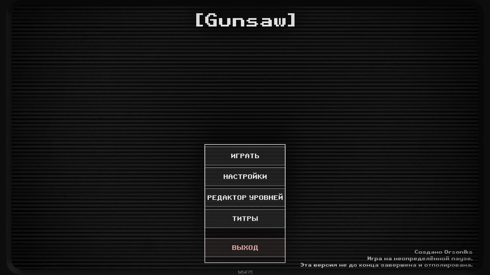
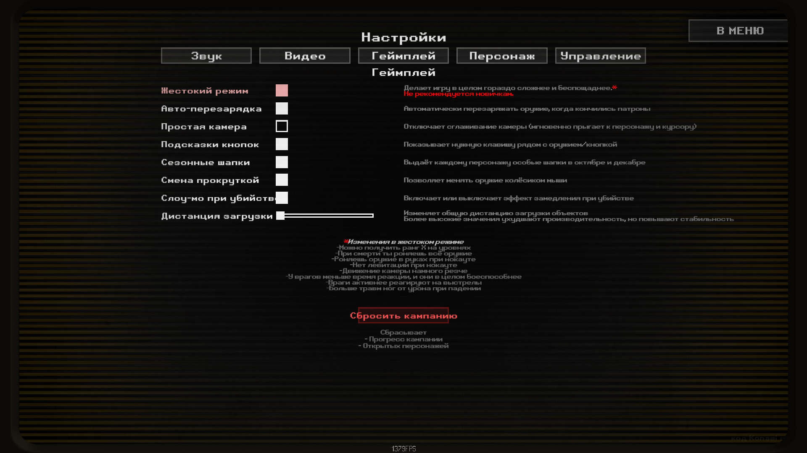
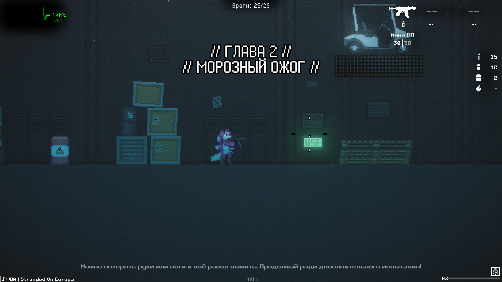
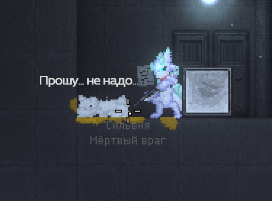
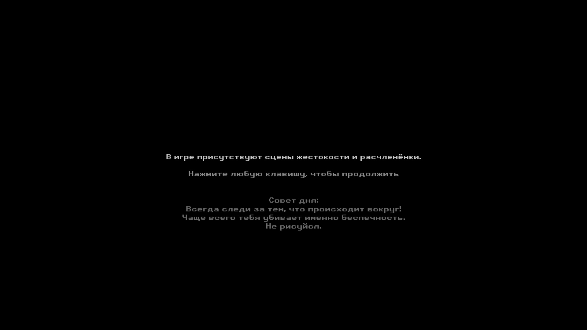

<div align="center">

# 🎮 Gunsaw — русификатор

Русский перевод демки [Gunsaw](https://orsonik.itch.io/gunsaw-demo): меню, настройки, сюжет, реплики врагов и имена. Ставится распаковкой архива в папку игры.

[](https://github.com/Profit155/gunsaw-russifier/releases/latest)
[](https://github.com/Profit155/gunsaw-russifier/releases)


<br>



</div>

## ℹ️ Что это

Фанатский перевод бесплатной демки Gunsaw. В комплекте идут кириллические шрифты, сделанные под игру, и сами переводы. Больше ничего ставить не нужно: **распаковал архив в папку игры — и играешь**. Интернет для работы перевода не требуется.

> Оригинальная игра — [**Gunsaw Demo**](https://orsonik.itch.io/gunsaw-demo) от **Orsoniks**. Перевод неофициальный и с автором игры не связан.

## ✅ Что переведено

Весь текст в игре:

- меню и интерфейс;
- настройки (звук, видео, геймплей, персонаж, управление);
- сюжет, диалоги, советы и подсказки;
- реплики врагов, причём у каждого вида свой шрифт;
- имена врагов и названия оружия.

## 📸 Как выглядит

<div align="center">
<table>
  <tr>
    <td width="50%"><br><sub>Настройки</sub></td>
    <td width="50%"><br><sub>Текст во время боя</sub></td>
  </tr>
  <tr>
    <td width="50%"><br><sub>Реплики врагов</sub></td>
    <td width="50%"><br><sub>Дисклеймер и совет дня</sub></td>
  </tr>
</table>
</div>

## 💬 Реплики врагов

У каждого вида врага свой шрифт реплик, подобранный под оригинальный. Роза говорит «граффити»-шрифтом, робот — пиксельным, и так далее.

<div align="center">

<br><sub>🌹 Роза: ящик, реплика, бочка, взрыв</sub>

<br><sub>🧪 Эксперимент: устранение и болтовня</sub>

<br><sub>🧟 Абоминация</sub>

<br><sub>⚔️ Геймплей: диалоги, смена тел, смерть</sub>

</div>

## 📥 Установка

1. **Скачайте** свежий `Gunsaw-Russifier-vX.X.X.zip` со страницы [Releases](https://github.com/Profit155/gunsaw-russifier/releases/latest).
2. **Распакуйте** архив в папку с игрой (туда, где лежит `Gunsaw.exe`), согласившись на замену файлов.
3. **Запустите** `Gunsaw.exe`.

> 💡 Перед установкой стоит скопировать куда-нибудь `Gunsaw_Data/resources.assets`: мод заменяет этот файл (в нём русские имена врагов), а копия позволит вернуть всё как было.
>
> ⏳ Первый запуск может длиться до минуты, пока инициализируется загрузчик модов, — это нормально.

## ❓ Если не работает

| Что не так | Что делать |
|---|---|
| Игра всё ещё на английском | Проверьте, что распаковали в корень игры: рядом с `Gunsaw.exe` должны появиться `winhttp.dll` и папка `BepInEx`. Запускайте именно `Gunsaw.exe`. |
| Долгий чёрный экран при первом запуске | Это инициализируется загрузчик модов. Подождите до минуты. |
| Антивирус ругается на `winhttp.dll` | Ложное срабатывание, это файл загрузчика модов (BepInEx). Добавьте его в исключения. |
| Вместо букв квадратики | Проверьте, что папка `fonts` тоже распакована в корень игры. |
| Хочу вернуть как было | Смотрите раздел «Удаление». |

## 🐞 Сообщить о проблеме

Нашли опечатку, кривую строку, что-то непереведённое или просто баг — напишите в [Issues](https://github.com/Profit155/gunsaw-russifier/issues/new). Принимаем **любые** сообщения, даже мелкие; по возможности приложите скриншот.

## 🗑️ Удаление

Удалите из папки игры файл `winhttp.dll` и папки `BepInEx` и `fonts`, затем верните `Gunsaw_Data/resources.assets` из копии (или проверьте целостность файлов игры).

<details>
<summary>🛠️ Для разработчиков: сборка, структура, инструменты</summary>

<br>

Состав репозитория:

- `src/GunsawRusFonts/` — BepInEx-плагин: рантайм-сборка кириллических TMP-шрифтов из `.ttf` (с фолбэком к игровым шрифтам, без перепаковки ассетов) и точечная подгонка вёрстки русских строк (`LayoutService`).
- `translations/ru/Text/` — переводы для XUnity AutoTranslator: UI (`ui_*.txt`), реплики врагов (`chatter_*.txt`), регэкспы и пре/постпроцессоры.
- `fonts/` — русифицированные `.ttf` с метриками, карта шрифтов `font_map.txt` (игровой шрифт → ttf-фолбэк) и правила вёрстки `layout_rules.txt`.
- `tools/` — Python-тулчейн: извлечение строк из ассетов, сборка переводов, имена врагов, чаттер.

Сборка плагина:

```sh
dotnet build src/GunsawRusFonts/GunsawRusFonts.csproj -c Release
```

Ручная установка на чистую игру (нужны BepInEx и XUnity.AutoTranslator):

- `GunsawRusFonts.dll` → `BepInEx/plugins/GunsawRusFonts/`;
- `fonts/` → в корень игры (рядом с `Gunsaw.exe`), плагин читает `<gameroot>/fonts/`;
- `translations/ru/Text/*.txt` → `BepInEx/Translation/ru/Text/`;
- в XUnity выставить `Language=ru`, пустой `Endpoint` (офлайн, перевод только из комплекта), см. `translations/config/AutoTranslatorConfig.ini`.

</details>
